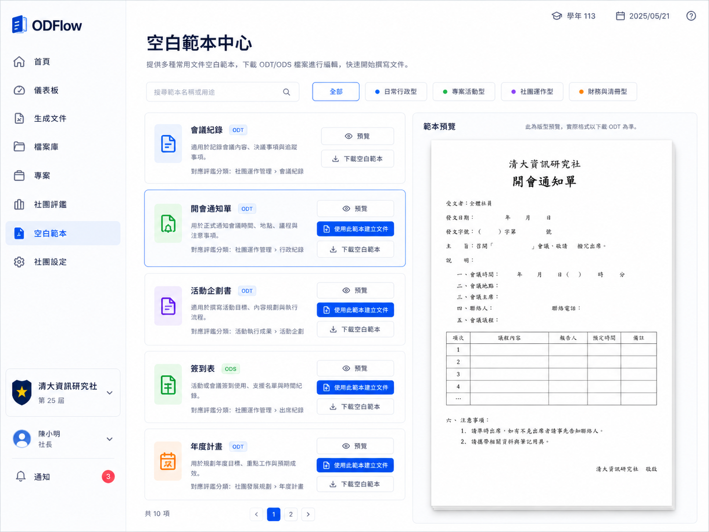
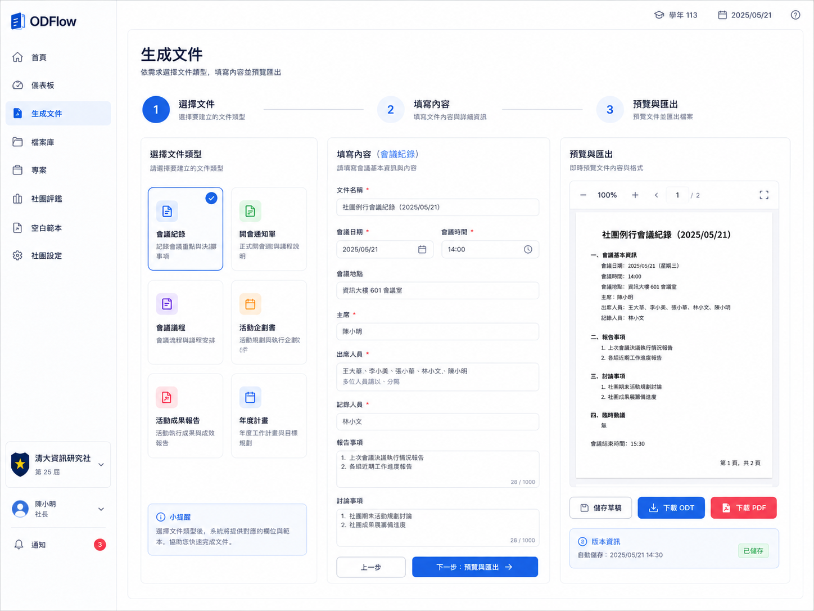

# ODFlow v0.4 UIUX 規格書

## 一、版本定位

ODFlow v0.4 的 UIUX 改版目標，是把目前可運作的 Streamlit 系統，升級成一個更像正式產品的「學生社團文件工作台」。

本版本 UIUX 不追求花俏，也不追求做成一般 AI 工具，而是要讓評審與學生社團使用者一眼看懂：

1. 這是用來整理社團文件的系統。
2. 這是用來下載與產出 ODF 文件的工具。
3. 這是用來協助社團評鑑資料整理的工作台。
4. 這不是單純的工程展示頁。

ODFlow v0.4 的核心視覺定位：

> 學生社團的 Google Docs 範本庫 + 文件工作台 + 社團評鑑整理工具。

## 二、UIUX 核心原則

### 1. 任務導向，不是功能堆疊

使用者進入 ODFlow 後，應該能快速理解三個問題：

1. 我要做什麼社團文件？
2. 這份文件長什麼樣？
3. 我要怎麼下載、生成、存檔或放進評鑑？

因此 UI 不應只是列出功能，而要以任務流程呈現。

### 2. 文件感優先

ODFlow 的核心是 ODT / ODS / PDF 文件，因此畫面中應大量使用「文件工作台」與「A4 預覽」的視覺語言。

特別是空白範本與生成文件頁，預覽應像文件，不應像 metadata 說明。

### 3. 淺色、正式、清楚

整體視覺建議：

- 淺色模式優先
- 白底與淺灰背景
- 卡片使用細框與輕陰影
- 主色使用穩重藍色
- 輔助分類使用小色點
- 避免過度使用 emoji
- 避免像工程後台或測試頁

### 4. 一致的對齊與卡片規則

所有頁面應遵守：

- 主要內容區寬度一致
- 同一排卡片高度盡量一致
- 卡片內資訊順序一致
- 按鈕位置一致
- 頁面上方只保留一次總說明
- 不要在每張卡片重複相同提示文字

## 三、整體資訊架構

v0.4 建議將側邊欄重新整理成任務導向。

### 建議側邊欄

工作台：

- 首頁
- 儀表板

文件製作：

- 空白範本
- 生成文件
- 檔案庫

評鑑整理：

- 社團評鑑

社團資料：

- 社團設定

### 專案頁處理

目前「專案」功能尚未成熟，建議暫時不要放在主要流程中。可以選擇：

1. 暫時從側邊欄移除。
2. 或保留為「未來功能」說明頁，但不放在核心展示路線。

## 四、共用版面規格

### 1. 左側導覽列

左側導覽列應包含：

- ODFlow logo
- 頁面導覽
- 社團資訊卡
- 使用者資訊
- 通知入口

目前建議導覽項目：

- 首頁
- 儀表板
- 生成文件
- 檔案庫
- 社團評鑑
- 空白範本
- 社團設定

### 2. 頁首資訊

右上角可保留：

- 學年
- 日期
- 說明 / 幫助入口

### 3. 卡片規則

每張卡片應盡量遵守以下順序：

1. 圖示
2. 標題
3. 一句話說明
4. 狀態或分類
5. 操作按鈕

不要把說明文字塞太多。每張卡片應該讓使用者快速判斷「這是什麼」與「下一步可以做什麼」。

## 五、首頁：社團文件工作台

### 1. 頁面定位

首頁不是一般歡迎頁，而是「社團文件工作台」。

目標是讓使用者 10 秒內理解 ODFlow 的用途。

### 2. 首頁應包含

#### A. Hero 區塊

內容：

- ODFlow
- 臺灣學生社團 ODF 文件工作台
- 從範本到文件產出，讓社團文件更有效率、更有條理。

#### B. 三個主要行動

首頁最重要的三個 CTA：

1. 下載空白範本
2. 建立正式文件
3. 整理社團評鑑

每個行動卡片應包含：

- 圖示
- 標題
- 一句話說明
- 箭頭或按鈕提示

#### C. 文件工作流程

用四步驟呈現：

1. 選範本
2. 填資料
3. 匯出 ODT / PDF
4. 整理評鑑

#### D. 最近文件

顯示最近建立或匯出的文件，例如：

- 文件名稱
- 類型：ODT / PDF / ODS
- 最後更新時間
- 狀態：已完成 / 編輯中 / 已歸檔

#### E. 評鑑提醒

顯示期中、期末評鑑、繳交期限、剩餘天數與查看評鑑進度。

#### F. 常用範本

顯示會議紀錄、開會通知單、活動企劃書。

## 六、空白範本中心

### 1. 頁面定位

空白範本中心是 v0.4 的核心頁面。

它應該像一個正式的 Template Gallery，而不是 metadata 列表。

頁面標題：

> 空白範本中心

頁面說明：

> 提供多種常用文件空白範本，下載 ODT / ODS 檔案進行編輯，快速開始撰寫文件。

### 2. 頁面結構

頁面上方：

- 搜尋框
- 分類篩選 chips

分類：

- 全部
- 日常行政型
- 專案活動型
- 社團運作型
- 財務與清冊型

每個分類前可以使用小色點。

### 3. 主要版面

建議使用左右分欄：

左側：

- 範本卡片列表

右側：

- A4 文件預覽

### 4. 範本卡片內容

每張範本卡片應包含：

- 範本名稱
- 格式標籤：ODT / ODS
- 一句話用途說明
- 對應評鑑分類
- 預覽按鈕
- 下載空白範本按鈕
- 若可建立文件，顯示「使用此範本建立文件」

卡片內不要重複出現「可直接下載空白範本，不需先建立文件」。這種說明只應出現在頁面上方一次。

### 5. 文件預覽

右側預覽應為「A4 文件版型近似預覽」。

預覽應包含：

- 白色紙張感
- 細框
- 輕陰影
- 文件標題
- 基本欄位
- 主要表格
- 主要章節

預覽上方或旁邊可放小字：

> 此為版型預覽，實際格式以下載 ODT 為準。

### 6. 不應出現在預覽或下載文件中的內容

正式文件預覽與下載檔案中，不應出現：

- 範本類型
- 建議格式
- 對應評鑑分類
- 使用情境
- 使用說明

這些是 UI 說明，不是正式文件內容。

## 七、生成文件頁

### 1. 頁面定位

生成文件頁應從一般表單頁，改成清楚的三步驟文件建立流程。

頁面標題：

> 生成文件

頁面說明：

> 依需求選擇文件類型，填寫內容並預覽匯出。

### 2. 三步驟流程

上方顯示：

1. 選擇文件
2. 填寫內容
3. 預覽與匯出

目前所在步驟應有明顯高亮。

### 3. Step 1：選擇文件

使用卡片選擇文件類型，例如：

- 會議紀錄
- 開會通知單
- 會議議程
- 活動企劃書
- 活動成果報告
- 年度計畫

### 4. Step 2：填寫內容

依照選擇的文件類型顯示欄位。欄位應分區顯示，不要一次塞成很長的表單。

### 5. Step 3：預覽與匯出

右側或下方顯示 A4 文件預覽。

操作按鈕：

- 儲存草稿
- 下載 ODT
- 下載 PDF

### 6. 生成文件頁設計原則

- 不要像資料庫表單
- 不要讓使用者不知道下一步
- 主要按鈕應明顯
- 表單欄位要對齊
- 預覽應讓使用者知道文件大概長什麼樣

## 八、儀表板

儀表板應是社團日常營運總覽，不應和社團評鑑頁完全重疊。

建議包含：

- 最近文件
- 常用範本
- 待補文件
- 本月活動
- 評鑑提醒小卡

## 九、社團評鑑頁

社團評鑑頁應專注於：

- 評鑑分類
- 文件完整度
- 缺件提醒
- ZIP 打包

應保留：

- 七大分類完整度
- 可打包文件
- 不可打包文件與原因
- ZIP 匯出

## 十、檔案庫

檔案庫應讓使用者知道目前已建立哪些文件，以及每份文件可以如何匯出或放入評鑑。

建議欄位：

- 文件名稱
- 文件類型
- 建立或更新時間
- 狀態
- 對應評鑑分類
- 操作：下載 ODT / PDF / 加入評鑑

## 十一、視覺設計基準

### 1. 色彩

建議：

- 背景：白色、淺灰、淡藍灰
- 主色：穩重藍色
- 成功：綠色
- 警示：橘色
- 錯誤或 PDF：紅色
- 類別：小色點輔助，不要大面積使用

### 2. 字體

不加入字型檔。

使用系統字體即可：

- macOS：PingFang TC
- Windows：Microsoft JhengHei
- fallback：sans-serif

### 3. 元件

常用元件：

- 卡片
- 分類 chip
- 狀態 badge
- A4 預覽卡
- 表格
- 步驟條
- 主要行動按鈕
- 次要按鈕

### 4. 間距與對齊

所有頁面應保持：

- 標題與內容左側對齊
- 卡片高度盡量一致
- 表格欄位對齊
- 按鈕位置一致
- 主要操作不要藏在文字中

## 十二、實作限制

本 UIUX 改版不應：

- 改資料庫 schema
- 改 ODT renderer 架構
- 改 ODT / PDF generator 主流程
- 新增 OpenAI
- 新增 Google Drive
- 新增登入與權限
- 新增複雜專案管理
- 新增大量功能
- 放入真實個資
- 放入使用者原始範本檔案
- 加入字型檔

## 十三、驗收標準

v0.4 UIUX 完成後，應符合：

1. 首頁看起來像社團文件工作台。
2. 空白範本中心看起來像正式範本庫。
3. 生成文件頁看起來像三步驟流程，不像雜亂表單。
4. 預覽像文件，不像 metadata 清單。
5. 卡片、按鈕、分類、狀態標籤有一致規則。
6. 側邊欄結構清楚。
7. 儀表板與社團評鑑頁職責不重疊。
8. 所有頁面沒有大量重複文案。
9. 三核心流程：下載範本、建立文件、整理評鑑，一眼可懂。
10. Streamlit Cloud 正常部署。
11. 所有 tests 通過。

## 十四、參考 UI 圖

本規格搭配三張 UI 參考圖：

1. `docs/assets/uiux/v04-home-workbench.png`
2. `docs/assets/uiux/v04-template-center.png`
3. `docs/assets/uiux/v04-generate-flow.png`

這三張圖只是設計方向參考，實際實作應以 Streamlit 可維護、可部署、可測試為優先。

## 參考 UI 圖

### 首頁：社團文件工作台

### 空白範本中心

### 生成文件流程

